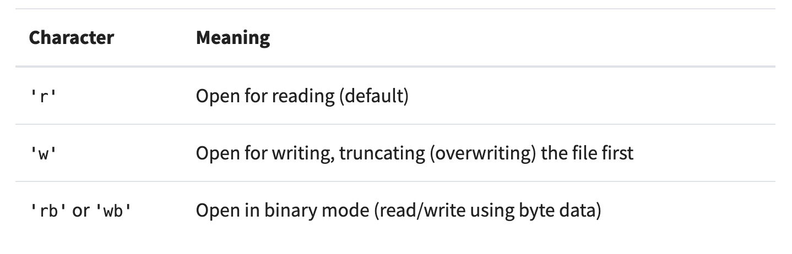

# FileIO & Exceptions

- The `open()` statement is used to open files, and should be accompanied by the `close()` statement to ensure we close the file after use

- It is important, and also your responsibility, to ensure that the files closes properly to prevent unwanted behaviors:
  - There are a couple ways you can ensure the file closes:
  - Try Finally:

```
    file = open('some_file.txt')
try:
    # Further file processing goes here
finally:
    file.close()

 ```
  - With Open:

```
with open('some_file.txt') as reader:
    # Further file processing goes here
```
- With open automatically closes the file for you after you are done with it
  - You can also use second positional arguments that tell the file the mode it should open in:

  

  - Syntax and Image resources [realpython](https://realpython.com/read-write-files-python/)

## Exceptions

- Throw an exception any time by using raise
- All statements in try clause executed until an exception is encountered
